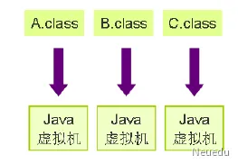

# 一、认识Java

## 1、Java语言平台

Java语言平台包括3个版本，标准版、企业版、微型版。

1. JavaSE：标准版(Standard )。JavaSE包含构成Java语言核心的类，适合开发桌面应用程序和底层应用程序。同时它也是JavaEE的基础平台。

2. JavaEE ：企业版(Enterprise)。JavaEE是在JavaSE平台的基础上构建的，它包含用于开发企业级应用的类，如EJB、servlet、JSP、事务控制等，为企业级应用提供了标准平台，简化复杂的企业级编程。

3. JavaME ：微型版(Micro)。包含JavaSE平台中一部分类，用于嵌入式系统开发，专门针对一些小型的消费电子产品，如：手机、PDA、机顶盒。

   

## 2、JDK与JRE

1. **JDK：**Java开发工具包(Java Development Kit)，是SUN公司提供的**一套Java开发环境。**JDK是整个Java开发的核心，其中包括Java编译器、Java运行工具、Java文档生成工具、Java打包工具等。在1996年1月，Sun公司发布了JDK1.0，随后相继推出了JDK1.1、JDK1.2、JDK1.3、JDK1.4、JDK5(1.5)、JDK 6(1.6)、JDK7(1.7)、JDK8(1.8)、JDK9-JDK21。目前企业应用较多的是比较稳定的JDK8，所以我们将针对JDK8进行讲解。

2. **JRE：**Java运行时环境(Java Runtime Environment)，是Sun公司提供的**一套Java运行环境。由于有些用户只需要运行事先编写好的Java程序，不需要自己动手编写，因此JRE中只包含Java运行工具，不包含Java编译工具。**

   注意：为了方便使用，Sun公司在其JDK中自带了一个JRE，也就是说开发环境中包含运行环境，这样一来，开发人员只需要在计算机上安装JDK即可。

   

## 3、验证是否配置成功

在窗口中输入“java -version”命令后，如果能正常地显示JDK对应版本信息，即说明系统环境变量配置成功。


## 4、 Java程序运行原理

通过HelloWord程序，我们不难发现，编写Java程序需要分3个步骤，编辑、编译、运行。实际上，Java程序是运行在Java虚拟机上的，Java虚拟机英文缩写为**JVM：Java Virtual Machine** ，虚拟机是一个虚构出来的计算机，有自己完善的硬体架构，如处理器、堆栈、寄存器等，还具有相应的指令系统。

Java虚拟机屏蔽了与具体操作系统平台相关的信息，使得Java程序只需生成在Java虚拟机上运行的目标代码文件（字节码文件），就可以在多种平台上不加修改地运行。

编辑、编译及运行Java程序的过程：


一个运行时的Java虚拟机实例的天职就是：负责运行一个Java程序。Java虚拟机的主要任务是装载class文件并且解释执行其中的字节码。当启动一个Java程序时，一个虚拟机实例也就诞生了。当该程序关闭退出，这个虚拟机实例也就随之消亡。如果同一台计算机上同时运行三个Java程序，将得到三个Java虚拟机实例。每个Java程序都运行于它自己的Java虚拟机实例中，如下图所示：

Java虚拟机示意图




## 5、注释

注释在编译阶段不会被编译，Java中的注释包含下面三种。

1．单行注释，以双斜线开头，本行内双斜线后面所有的内容为注释内容。如：

```java
//test
```

2．多行注释，以斜线星开头，星斜线结尾，中间的所有内容为注释内容。如：

```java
/* 
*test
*/
```

3．文档注释，以斜线两个星开头，星斜线结尾，中间的所有内容为注释内容。文档注释可以生成JavaDOC

```java
/** 
* @author neuedu 
*/
```


## 6、Java语言特点

### 1. 跨平台

通过上面的Java运行原理，我们不难发现，Java程序由虚拟机负责解释执行，而并非操作系统决定。

Java编译器会将Java源程序编译成不同操作系统下的字节码文件，这样便可以实现Java程序的跨平台。


### 2. 半编译半解释

编程语言分为编译型语言和解释型语言。

编译型语言编写的程序在执行之前需要一个专门的编译过程，把程序编译成为机器语言的文件，运行时则不需要重新翻译，直接使用编译的结果就行。程序执行效率高，依赖编译器，跨平台性差，如C/C++等。

解释型语言编写的程序不需要编译，每次运行，都需要一边运行一边翻译，因而效率低，但是靠着解释器，跨平台性好，如PHP，JavaScript，Python等。

而Java语言编写的程序，运行之前需要先编译成字节码文件，所以Java语言是半编译半解释类型的语言。

### 3. 面向对象

面向对象编程是目前大多数编程语言都具备的特性，Java也不例外，因为Java语言最初的设计完全是面向对象的，所以面向对象是Java最基本的特性，面向对象的各种特性在Java语言中都可以使用。

### 4. 分布式

Java包括一个支持HTTP和FTP等基于TCP/IP协议的子库。因此，Java应用程序可凭借URL打开并访问网络上的对象，就像访问本地文件一样简单方便。Java的分布性为实现在分布环境尤其是Internet下实现动态内容提供了技术途径。

### 5. 支持多线程

线程有时也称小进程，是一个大进程里分出来的小的独立运行的基本单位。Java提供的多线程功能使得在一个程序里可同时执行多个小任务，即同时进行不同的操作或处理不同的事件。多线程带来的更大的好处是具有更好的网上交互性能和实时控制性能，尤其是实现多媒体功能。


# 二、变量和运算符

## 1、标识符

在Java语言中，通过标识符来表示一些元素的名字，比如变量名、类名、方法名和包名等。Java中的标识符要符合下面的规则：

1. 标识符必须以字母、下划线（_）、数字或美元（$）组成；
2. 标识符必须由字母、下划线（_）或美元（$）开头，不能由数字开头；
3. 标识符不能是关键字或者保留字；
4. 标识符中不能有空格;
5. 标识符没有长度限制。

例如，A_123，$abc，length都是合法的标识符，而1a，s+g就是非法的标识符。


在生产环节中，各个公司对标识符有特定的要求，也就是说在满足是标识符的基础之上又增加代码的可读性和规范性的要求，提出了很多规范。在我们东软集团开发规范中有如下要求【部分】：


**各个公司均有自己的规范，请大家届时主要遵守即可！**

**提示：**

1. Java区分大小写，因此area和Area是两个不同的标识符；
2. 为提高程序的可读性，建议使用有意义的命名标识符，如area，length等。


## 2、变量

变量（variable）是用来存储数据的一块存储区域，在程序运行中它的值可以发生变化。变量可以存放一种数据类型的值，Java程序在运行加载时会根据变量的不同数据类型来分配不同的内存空间，变量的数据类型在声明时指定。

变量是指在程序的运行过程中随时可以发生变化的量，作用是：

1．变量是程序中数据的临时存放场所

2．保存程序运行时用户输入的数据

3．特定的运算结果等


### 2.1 变量的声明

一个变量只有在声明后才有效，声明的作用就是确定该变量要存储的数据类型。声明变量的语法格式如下：

数据类型 变量名，

如： int age；

如果要同时声明多个相同数据类型的变量，可以如下写：

数据类型 变量名1,变量名2;

代码举例如下：

int number, max;

变量在声明后，不能直接访问，只有被赋值的变量才能够被访问，否则就会出现运行错误。


### 2.2 变量的赋值

第一次给变量赋值叫"初始化"。使用等号"="来进行赋值，语法如下：

变量名 = 数据值;

例如：

```java
int number;

number = 1000;
```

也可以把变量的声明和初始化合用一个语句实现出来，例如上面两行代码就可以改写成一行代码：

```java
int number = 1000;
```


### 2.3 常量

在程序中往往会存在变量值不需要变化的情况，比如表示圆周率的变量，比如表示黄金分割点的变量，那么这些值不允许发生改变的变量就叫常量。

在Java中，常量用关键字 final 来表示（在后面章节会详细讲解），它也是有数据类型的，语法如下：

final  数据类型   常量名（大写） =  初始值;

**提示：**

1. 常量在声明的时候必须初始化；
2. 常量在初始化后值不能再更改，否则会引起错误。

例如：

```java
final double PI = 3.14;
```


## 3、基本数据类型


### 3.1 整型

Java语言的整型常量默认为int型，声明long型后面需加上 l 或者 L ，否则会出错。

Java中整型的四种表示形式：

1. 十进制整数：0 ~ 9，注：第一位不能是0
2. 十六进制数：0 ~ 9 A ~ F, 注：必须以 0x 或 0X 开头，例如： 0X8A 0x12
3. 八进制整数：0 ~ 7，注：必须以 0 开头，例如： 0123 012
4. 二进制整数：0~1，注：必须以 0B 开头（在java1.7及以上版本可用），例如： 0B1010


### 3.2 浮点型

**浮点型数据类型表**


Java浮点型常量默认为double型，如要声明一个常量为float型，则需在数字后面加f或F，如:

```java
double d = 12345.6;
float f = 12.3F;
```

**提示：**

1. 带小数的数据默认是 double 型而非 float 型的；
2. 定义 float 型数据需要后面紧跟"f"或"F"来表示，比如float f = 2.1F；（在编程规约中用 F）
3. 定义长整型数据，可以后面紧跟"l"或"L"来表示。


### 3.3 字符数据类型

字符数据类型用于存放单个字符，每个字符占用2个字节（16位二进制）的内存空间。一个字符型数据由单引号括起来，使用"char"关键字来说明数据类型，如下：

```java
char letter = 'a';
```


常用的几个字符的ASCII码

a 的十进制ASCII码是 97

A 的十进制ASCII码是 65

0 的十进制ASCII码是 48


**提示：**

1. 字符型只表示一个字符，不能表示多个字符，比如 'abc' 是错的；
2. 字符型只能用单引号（'）括起来，用双引号（"）括起来的不是字符，而是字符串（String），比如"a"表示的不是char型字符而是String型字符串。


Java还允许使用转义字符来表示特殊字符。转义字符用斜杠"\"打头，后面跟一个字符。

常见的转义字符如下表。

**常见转义字符**


### 3.4 布尔数据类型

布尔数据类型由关键字boolean来表示，布尔型数据的值域只有两个值：true和false。例如，下面两行代码：

```java
boolean isOK = true;
boolean isFirst = false;
```

**提示：**

1. true 和 false 都是小写，True、TRUE、False、FALSE都不是布尔型数据的值；
2. 布尔型数据不能用数字0和1来表示真假，只能用 true 和 false；
3. 布尔型数据默认值是 false。

**例: 布尔数据类型**

```java
boolean flag;
flag = true;
```


## 4、数据类型转换

### 4.1 自动数据类型转换

自动数据类型转换也称之为隐式类型转换，小空间的数据类型可以自动转换成大空间的数据类型，也就是说低精度的数据可以升级成高精度的数据。数据类型的自动转换顺序如下图：


### 4.2 强制数据类型转换

强制数据类型转换也称之为显式类型转换，强制转换的语法就是用圆括号括起你要转换成的目的数据类型：

变量=（目标类型）值;

例如：

```java
byte a;
int b;
a = (byte)b;
int i = (int)2.8;  // i = 2
float f = (float)5.2;
```


**提示：**

1. boolean型数据不能和其他基本数据类型进行转换；
2. char型和int型数据可以互换；
3. byte、short、char之间不会相互转换，它们三者在计算时首先会转换为int类型；
4. 在强制类型转换过程中，源类型的值可能大于目标类型，因此可能造成精度降低或溢出，使用时需注意。


## 5、逻辑运算符短路与 vs 非短路

### 5.1 短路与 vs 非短路与

```java
//短路与&& vs 非短路与&
int a =10;
int b =20;
int c =30;

boolean flag = a > b && ++b > c; // 左边为假，右边短路了,不再执行
System.out.println(flag);//false
System.out.println(b);//20

boolean flag = a > b & ++b > c; // 右边不短路，会继续执行
System.out.println(flag); // false
System.out.println(b); // 21	
```


### 5.2 短路或 vs 非短路或

```java
//短路或|| vs 非短路|		
int a =10;
int b =20;
int c =30;

boolean flag = a < b|| ++b > c; // 左边为真，右边短路了，不再执行
System.out.println(flag); // true
System.out.println(b); // 20

boolean flag = a < b | ++b >c; //右边不短路，会继续执行
System.out.println(flag); // true
System.out.println(b); // 21	
```


## 6、三目（三元）条件运算符

三目条件运算符的语法为：

表达式1 ? 表达式2 : 表达式3

如果 表达式1为真，取表达式2的值，否则取表达式3的值

举例如下：

```java
int a = 3, b = 6;
int x = a > b ? a : b;
```

那么计算结果就是x=6。

在三目条件运算中，表达式1和表达式2的值可以是任意一种基本数据类型。

例：	

```java
int a = 10;
int b = 20;
boolean flag = a<b? true : false;	
char c = a < b ? '真' : '假';	
String ret = a < b ? "正确" : "错误";
int x = a < b ? 1 : 0;		
double y = a < b ? 1.0 : 2.0;
```


# 三、**流程控制语句**

## 1、分支【选择】结构

### 1.1 if语句

#### 1.1.1 **if语句（单一条件）**

```java
int x = 0;
if(x == 1){
    System.out.println("x等于1");
}
System.out.println("x的值为" + x);
```


#### 1.1.2 **if语句（二选一）**

```java
int n = 7;
if (n % 2 != 0) {
    System.out.println("n是奇数");
    System.out.println("条件表达式返回值为真");
}else {
    System.out.println("n不是奇数");
    System.out.println("条件表达式返回值为假");
}
```

当有多个if在程序的语句中存在时，else与最近的if匹配。例如：

```java
if(条件表达式1){
    功能代码块1;
}
if(条件表达式2){
    功能代码块2;
}else{
    功能代码块3;
}
```

其中，else对应条件表达式2，条件表达式1的if语句将独立执行。


#### 1.1.3 **if语句（多选一）**

```java
int i = 55;
if (i >= 90 && i <=100) {
    System.out.println("成绩是A");
} else if (i >= 80) {
    System.out.println("成绩是B");
} else if (i >= 70) {
    System.out.println("成绩是C");
} else if (i >= 60) {
    System.out.println("成绩是D");
} else {
    System.out.println("成绩是E");
}
```


### 1.2 switch语句

```java
int n = 2;
int result;
switch (n) {
    case 1:
        System.out.println("Block A");
        result = n;
        break;
    case 2:
        System.out.println("Block B");
        result = n * n;
        break;
    case 3:
        System.out.println("Block C");
        result = n * n * n;
        break;
    default:
        result = 0;
        break;
}
System.out.println("result=" + result);
```

**语法说明：**

1. switch 括号里的表达式类型只能为 int 类型或者能自动转换为 int类型的数据类型（byte、short、char），在JDK7中增加了对String类型的支持；

2. case 语句后的值只能为常数或常量，不能为变量，而且值不能重复。

switch语句的代码执行过程为：
将 case 语句后的值和表达式的值比较，若相等即从该 case 语句开始向下执行，如果没有 break 语句，则一直执行到 switch 语句的结束，如果遇到 break 语句，则结束 switch 语句的执行。


**例**：使用switch语句实现百分制成绩到成绩等级的转换。

```java
int score = 100;
switch (score / 10) {
    case 10:
    case 9:
        System.out.println("成绩等级为A");
        break;
    case 8:
        System.out.println("成绩等级为B");
        break;
    case 7:
        System.out.println("成绩等级为C");
        break;
    case 6:
        System.out.println("成绩等级为D");
        break;
    default:
        System.out.println("成绩等级为E");
}
```


## 2、循环结构

**循环结构**是指在程序中需要反复执行某个功能而设置的一种程序结构。需要被反复执行的这段代码称为循环体，它由循环结构中的**循环条件**决定是继续执行循环体还是终止循环。根据判断条件,循环结构又可细分为以下两种形式:

1. 先判断后循环的循环结构。（ while语句、for语句 ）

1. 先循环后判断的循环结构。（ do-while语句 ）

在Java语言中，实现循环结构的语句有三种，分别是while语句、do-while语句和for语句。


### 2.1 while语句

while语句的代码执行过程为：
首先判断循环条件，如果循环条件为true，则执行循环体代码，然后再判断循环条件，直到循环条件不成立时停止执行。如果首先判断循环条件就为false，则不执行循环体，直接执行while语句后续的代码。

**语法说明：**

1. 循环条件的类型为布尔类型，指循环成立的条件；

1. 花括号{}不是必须的，当循环体中只有一条语句时，可以省略；（ if也是如此 ），（注意：在编码规约中都要写花括号）

1. 循环体是需要重复执行的代码。


**例** 使用while语句输出x的值。

```java
int x = 1;
while(x < 3){
    System.out.println("x=" + x);
    x++;
}
```

**例** 使用while语句计算1+2+3+...+10的和。

```java
int i = 1;
int sum = 0;
while (i < 11) {
    sum += i;
    i++;
}
System.out.println("1+2+...+10=" + sum);
```

 

### 2.2 do-while语句

do-while语句是 "先循环再判断"的流程控制结构。

```java
int x = 3;
do{
    System.out.println("x=" + x);
    x++;
} while(x < 3);
```

运行结果为 x = 3


### 2.3 for语句

```java
for(表达式1;表达式2;表达式3){
	循环体;
}
```

**语法说明：**

1. 表达式1用于初始化，一般书写变量初始化的代码，例如循环变量的声明、赋值等，它在for语句中执行且只执行一次。表达式1可以为空；

1. 表达式2是循环条件，要求必须为布尔类型，如果该条件为空，则默认为true，即条件成立；

1. 表达式3为迭代语句，是指循环变量变化的语句，一般书写i++、i--这样的结构。该语句可以为空。

1. 循环体指循环重复执行的功能代码。

1. 花括号{}不是必须的，当循环体部分只有一条语句时可以省略。


**例** 用for循环改写从1到100的所有奇数相加的和。

```java
int sum = 0;
for (int i = 1; i <= 100; i++) {
    if (i % 2 != 0)
        sum += i;
}
System.out.println("1到100之间的奇数和为" + sum);
```


### 2.4. 嵌套循环

**例**：在控制台打印九九乘法表

```java
for(int i=1;i<=9;i++) {
        for(int j=1; j<=i;j++) {
            System.out.print(i+"*"+j+"="+i*j+"\t");
        }
        System.out.println(); //换行
}
```


### 2.5 循环的中断

在使用循环语句时，只有循环条件表达式的值为 false 时，才能结束循环。有时，想提前中断循环，要实现这一点，只需要在循环语句块中添加 break 或 continue 语句。

#### 2.51 **break语句**

在前面switch语句的介绍中已经接触过break语句，其功能是中断switch语句的执行。同样，break语句可以出现在while、do...while、for循环等语句中，能够立即结束本循环语句的执行。

**例**：请计算一个最小整数N，使得1+2+3...+N的和大于等于666首次成立。

```java
int i, sum=0;
for (i = 1; i < 101; i++) {
    sum += i;
    if (sum >= 666) {
        break;
    }
}
System.out.println("从1到" + i + "的和为" + sum);
```


#### 2.52 **Continue语句**

continue 语句只能出现在循环结构中，也完成循环的终止。但与 break 语句的区别在于：

continue 语句只跳出**一次**循环，整个语句还继续执行；

break语句则完全跳出它所在或所标记的循环。

下面以while语句为例，来说明continue语句的功能。
**例** 显示20以内的奇数。

```java
for (int i = 1; i < 20; i++) {
	if ((i % 2) == 0) {
    	continue;
    }
	System.out.print(i + " ");
}
```


## 3、控制语句的应用

### 3.1 水仙花数

问题描述：水仙花数指一个特殊的三位数，它的各位数字的立方和与其自身相等。请输出所有的水仙花数。
编程思路：关键是将三位数的个位、十位和百位数字分别拆分出来。
**例** 水仙花数的求解。

```java
for (int i = 100; i < 1000; i++) { // 循环所有三位数 100-999
    int a = i % 10;  // 拆分出个位数字
    int b = (i / 10) % 10;  // 拆分出十位数字
    int c = i / 100;  // 拆分出百位数字
    // 判断立方和是否等于自身
    if (a * a * a + b * b * b + c * c * c == i) {
        System.out.println(i);
    }
}
```


### 3.2 **求两个自然数的最大公约数**

问题描述：最大公约数指两个数字公共的约数中最大的，例如数字3的约数有1、3，数字9的约数有1、3、9，则数字3和数字9的公共约数有1和3，其中3是最大的公约数。

第一种编程思路：假设初始值从1开始逐步增1，每次把能同时使两个数整除的值都存储起来，那么最后一个存储起来的值就是最大的约数。
**例**求8和12的最大公约数。

```java
int m = 8;
int n = 12;
int result = 1;
for (int i = 1; i <= m; i++) {
    if ((m % i == 0) && (n % i == 0)){
        result = i;
    }
}
System.out.println(result);
```


第二种编程思路：设定初始值为两个数字中最小的数字，逐步减1，那么第一次得到的能同时使两个数整除的值就是最大公约数。
**例** 求9和12的最大公约数。

```java
int num1 = 9;
int num2 = 12;
int result1 = num1 > num2 ? num2 : num1;
for (int i = result1; i >=1; i--){
    if ((num1 % i == 0) && (num2 % i == 0)){
        result1 = i;
        // 第一次得到的能同时使两个数整除的值就是最大公约数，所以要 break 跳出。
        break;
    }
}
System.out.println(result1);
```


#### 3.2.1 求 12 和 18 的最小公倍数

先求 12 和 18 的最大公约数，然后最小公倍数 等于 12 * 18 / 最大公约数

```java
int n1 = 12;
int n2 = 18;
int result1 = 1;
for (int i = 1; i <= n1; i++) {
    if ((n1 % i == 0) && (n2 % i ==0)){
        result1 = i;
    }
}
System.out.println(n1 * n2 / result1);
```


### 3.3 百元百鸡问题

方法一：首先确定母鸡的购买数量为0，使公鸡的购买数量从0-100逐次变化，每当公鸡的数量变化一次，小鸡的数量就从0逐次变化到100。

```java
for (int i = 0; i < 101; i++) {
    // 公鸡数量
    for (int j = 0; j < 101; j++) {
        // 小鸡数量
        for (int k = 0; k < 101; k++) {
            if ((i + j + k == 100) && (i * 3 + j * 4 + k * 0.5 == 100)) {
                System.out.println("母鸡数量：" + i + "\t公鸡数量：" + j + "\t小鸡数量：" + k);
            }
        }
    }
}
```


方法二：100元最多能购买33只母鸡，若只买公鸡只能买25只，而按照用100元买100只的要求，100减去公鸡和母鸡的购买数量即是小鸡的购买数量。

```java
for (int i = 0; i < 34; i++){
    // 100元最多能购买25只公鸡
    for (int j = 0; j < 26; j++) {
        // 小鸡数量
        int k = 100 - i -j;
        if (i * 3 + j * 4 + k * 0.5 == 100){
            System.out.println("母鸡数量：" + i + "\t公鸡数量：" + j + "\t小鸡数量：" + k);
        }
    }
}
```


### 3.4 打印图形

```java
Scanner scanner = new Scanner(System.in);
// n 是输入的行数
int n = scanner.nextInt();
// i 是所在行号
for (int i = 1; i <= n; i++) {
    // j 是打印空格的数量，空格的数量 = n - i
    for (int j = 1; j <= n - i; j++) {
        System.out.print('$');
    }
    // k 是打印星号的数量， 星号的数量 = 2 * i -1
    for (int k = 1; k <= 2 * i - 1; k++) {
        System.out.print('*');
    }
    // 换行
    System.out.println();
}
```


### 3.5 质数判断

问题描述：如何判断某个自然数是否为质数。
质数是只能被1和自身整除的自然数，也称素数，质数中最小的为2。所有自然数都可以被自身和1整除。

编程思路：我们只需判断一个数能否被1和自身以外的数字整除即可，大于其本身的自然数除外。若数字为n，则只需判断从2到n-1之间的所有数字，即程序只需判断该数能否被区间[2,n-1]内的某个自然数整除即可，若在区间内存在能被整除的数则说明不是质数。

```java
Scanner scanner = new Scanner(System.in);
// 输入一个数
int n = scanner.nextInt();
// flag 代表是不是质数，是为 true，反之为 false
boolean flag = true;
for (int i = 2; i < n; i++) {
    if (n % i == 0) {
        flag = false;
        break;
    }
}
// 输出结果，判断 n 是否为质数
if (flag) {
    System.out.println(n + "是质数");
} else {
    System.out.println(n + "不是质数");
}
```


# 四、**数组**

数组是多个相同类型的数据按照顺序组合后的一种数据类型，用来实现对这些数据的统一管理。

## 1、数组的创建

### 1.1 静态方式创建

```java
数组类型[]  数组名 = {数组元素1，数组元素2,.......数组元素n};
```

```java
int[] arr = {1,2,3,4,5};
```


### 1.2 动态方式创建

```jav
数组类型[] 数组名 = new 数组类型[数组长度];
```

```java
int[] arr = new int[5];
```


### 1.3 动静态结合创建

```java
数组类型[] 数组名 = new 数组类型[]{数组元素1，数组元素2,.......数组元素n};
```

```java
int[] arr = new int[]{1,2,3,4,5,6,7,8};
```

new int[]{1,2,3,4,5,6,7,8}   [ ]里不能指定长度


## 2、数组的初始化

### 2.1 数组元素的默认值

数组元素有默认值：

**对于 数字类型（byte short int long），默认值为 0**，

**float double默认值为 0.0f  0.0**

**对于 字符型（char），默认值为 ‘\u0000’，**

**对于 布尔类型（boolean），默认值为 false, **

**对于 字符串类型（引用类型），默认值为 null。**


## 3、数组的长度属性

1. **数组创建后其长度就不能更改**

2. **数组的长度 (length) 必须>=0**

3. **length 为只读，无法改变，所有对length属性的赋值操作都是非法的**

   

**在生产过程中，通常利用length属性来遍历数组**

```java
int[] num = {11, 300, 5, 77, 99};
for (int i = 0; i < num.length; i++) {
    System.out.println(num[i]);
}
```


## 4、数组的异常

```java
ArrayIndexOutOfBoundsException    // 数组下标越界
```


## 5、数组的排序和查找

### 5.1 数组的排序

#### 5.1.1 选择排序

```java
// 选择排序
// arr 共有 8 个元素
int[] arr = {99, 87, 25, 1, 1500, -80, -7, 100};
// 8个元素两两比较，只比较7轮
for (int i = 0; i < arr.length - 1; i++) {
    for (int j = i + 1; j < arr.length; j++) {
        if (arr[i] > arr[j]) {
            // 交换两个元素的位置
            int temp = arr[i];
            arr[i] = arr[j];
            arr[j] = temp;
        }
    }
}
// 输出排序完的数组
System.out.println(Arrays.toString(arr));  // [-80, -7, 1, 25, 87, 99, 100, 1500]
```


#### 5.1.2 冒泡排序

```java
// 冒泡排序
int[] arr = {9, 8, 5, 4, 2, 0};
// 比较轮数  6个数比较5轮
for (int i = 0; i < arr.length - 1; i++) {
    // 每轮比较的位置
    for (int j = 0; j < arr.length -1 - i; j++) {
        if (arr[j] > arr[j + 1]) {
            int temp = arr[j];
            arr[j] = arr[j + 1];
            arr[j + 1] = temp;
        }
    }
}
System.out.println(Arrays.toString(arr));
```


#### 5.1.3 Arrays.sort方法

```java
Arrays.sort(arr_name) ;
Arrays.sort(arr_name,fromIndex,toIndex);
```


## 6、二分查找

```java
// 二分查找
/*
    二分查找的前提是需要查找的数组必须是已排序的，这里实现默认前提为升序。
    查找时将数组分为三部分，依次是中值（所谓的中值就是数组中间位置的那个值）前，中值，中值后；
    将要查找的值和数组中的值进行比较，若小于中值则在中值前面找，若大于中值则在中值后面找，等于中值时直接返回。
    从描述上就可以看出这个算法适合用循环来实现。
*/
int[] num = {1, 2, 3, 4, 5, 6, 7, 8};
// 需要查找的值
int key = 6;
// 下标
int index = -1;
// 最低下标
int low = 0;
// 最高下标
int high = num.length;
while (high >= low) {
    // 中间下标
    int mid = (low + high) / 2;
    // 如果 key 小于中间值
    if (key < num[mid]) {
        // 最高下标调到中间下标前一个
        high = mid - 1;
        // 如果 key 等于中间值
    } else if (key == num[mid]) {
        index = mid;
        break;
        // key 大于中间值
    } else {
        // 最低下标调到中间下标前一位
        low = mid + 1;
    }
}
if (index == -1) {
    System.out.println("数组中不存在元素" + key);
} else {
    System.out.println("元素" + key + "在数组中的下标是" + index);  //  元素6在数组中的下标是5
}
```


## 7、数组的复制

```java
System.arraycopy( source, srcPos, dest, destPos, length );
```

复制source数组中从下标srcPos开始的length个元素到目标数组dest，

并从目标数组的下标为destPos的位置开始储存 ，其中各个参数的含义如下：

@source：源数组  

@srcPos：源数组中的起始位置 

@dest：目标数组 

@destPos：目标数组中的起始位置 

@length：要复制的数组元素的个数


## 8、二维数组

```java
// 二维数组
// 创建一个二维整型数，给二维数组赋值同时遍历二维数组。
int[][] num = {{1, 2, 3, 4, 5}, {6, 7, 8, 9, 10}, {11, 12, 13, 14, 15}};
for (int i = 0; i < num.length; i++) {
    // num[i].length = 5  二维数组列循环
    for (int j = 0; j < num[i].length; j++) {
        System.out.print(num[i][j] + " ");
    }
    // 换行
    System.out.println();
}
// 1 2 3 4 5
// 6 7 8 9 10
// 11 12 13 14 15
```

```java
// 查找二维整型数组中的最大数及其位置。
int[][] num = {{23, 2, 64, 16}, {35, 56, 97, 28}, {29, 10, 81, 12}};
// 最大值
int max = 0;
// 行
int x = 0;
// 列
int y = 0;
for (int i = 0; i < num.length; i++) {
    for (int j = 0; j < num[i].length; j++) {
        if (num[i][j] > max) {
            max = num[i][j];
            x = i + 1;
            y = j + 1;
        }
    }
}
System.out.println("该二维数组中最大值是:" + max);
System.out.println("位置是第" + x + "行，第" + y + "列");
```


# 五、**方法的定义和调用**

## 1、方法引入

方法是程序设计语言中重要的组成部分，可以说程序的功能都是通过方法和方法间的调用来实现的。方法的作用是用来描述功能和行为动作。

方法具有以下多种优势：

1. 将程序分解成更小的块
2. 降低理解难度，提高程序质量
3. 减小程序体积，提高代码可重用性
4. 降低了软件开发和维护的成本

```java
public class Method01 {
    public static void main(String[] args) {
        // 方法的调用
        printRect(3);
        printRect(5);
        printRect(7);
    }

    // 打印一个 n 行 n 列的矩形
    public static void printRect(int n) {
        for (int i = 0; i < n; i++) {
            for (int j = 0; j < n; j++) {
                System.out.print("*");
            }
            // 每打印完一行星号换一次行
            System.out.println();
        }
        // 每打印完一个矩形换一次行
        System.out.println();
    }

}
```


## 2、方法声明的语法

```java
[访问控制符] [修饰符] 返回值类型 方法名( 参数类型 形式参数,参数类型 形式参数,…) {
    方法体
}
```


例 一个求两数最大值的例子：

```java
public static int getBigger(int num1, int num2){ 
    if (num1 > num2)  {
        return num1;
    } else{
        return num2;   
    }
}
```

这个方法的功能为求两个参数num1和num2的最大值，

修饰符包含两个，分别为 public 和 static

返回值类型为 int

方法名为 getBigger

包含两个参数，都是 int 类型的


下面我们对方法的结构进行详细介绍：

1. 修饰符：修饰符是可选的，它指定了方法的属性并且告诉编译器该方法可以如何调用，public 、static 被称为修饰符。

2. 返回值类型：返回值类型是方法要返回的值的数据类型，例如可以是 int，若方法不返回值，则返回值类型为关键字 void。
3. 方法名：它作为调用时引用方法的标识。
4. 参数列表：

​	a. 方法可以有一个参数列表，按方法的规范称为形式参数。

​	b. 当方法被调用时，形式参数用变量或数据替换，这些变量或数据称为实际参数。

​	c. 参数是可选的，方法的参数个数可以是0个到多个，每个参数前面要声明参数的数据	    类型；每个参数要用逗号分开。

5. 方法体：它是一个语句块，执行特定的功能操作。对于有返回值类型的方法，方法体当中最后一个语句是return关键字，它的作用是把方法的执行（运算）结果返回到方法外部。

6. return 表达式：return后面的表达式就是方法的返回值。需要注意表达式的类型，必须与方法头中声明的"返回类型"相匹配。


## 3、方法的分类及实现

方法的编写和应用都比较灵活，主要是从参数和返回值两个方面去变化，那么可以对方法进行两种分类。


### 3.1 无返回值，无入参的方法【黑洞方法】

```java
public class Method02 {
    public static void main(String[] args) {
        // 无返回值，无入参的方法  黑洞方法
        drawRect();
    }
    public static void drawRect(){
        int width = 10;
        int height = 5;
        for (int i = 0; i <height; i++) {
            for (int j = 0; j < width; j++) {
                System.out.println('#');
            }
            System.out.println();
        }
    }
}
```


### 3.2 无返回值，有入参的方法【消费者方法】

```java
public class FunctionDemo{ 
 // getBigger(1,2);
    public void getBigger(int x, int y ) { 
        if( x>=y ) { 
             System.out.println( x ); 
        } 
        else{ 
             System.out.println( y ); 
        } 
        return; //没有返回值，return可以省略，或者用于结束函数
    } 
}
```


### 3.3 有返回值，无入参的方法【生产者方法】

```java
//  c = add(); 
// add();
public static int add(){
	int x=100;
	int y=200;
	int z =x+y;
	return z; // 必须有return，而且后必须跟随一个与返回值类型兼容的表达式
}
```


### 3.4 有返回值，有入参的方法

```java
public class FunctionDemo { 
    // absolut(1); 
    // c =  absolut(2);
    public int absolut(int x){
        if(x>=0){
            return x; 
         } else{
            return -x;
         } 
    }    
 }
```


## 4、方法的调用

```java
// 如果方法返回一个值，对方法的调用通常就当做一个值处理。
int i = add();
// 如果方法返回void，对方法的调用应是当做语句处理。
drawRect();
```


## 5、方法的值传递和引用传递

### 5.1 值传递（不影响实参）

基本数据类型（如int、long等） 

在方法调用的时候，实参是将自己的一份拷贝赋给形参，在方法内，对该参数值的修改不影响原来的实参。

```java
public class Method04 {
    // 值传递
    // 在方法调用的时候，实参是将自己的一份拷贝赋给形参，在方法内，对该参数值的修改不影响原来的实参。
    // baseValue 的值复制了一份给 value， baseValue 本身数值不变
    public static void updateBaseValue(int value) {
        value = 2 * value;
        System.out.println("value的值是" + value);  // value的值是60
    }

    public static void main(String[] args) {
        int baseValue = 30;
        System.out.println("调用前baseValue的值：" + baseValue);  // 调用前baseValue的值：30
        updateBaseValue(baseValue);
        System.out.println("调用后baseValue的值：" + baseValue);  // 调用后baseValue的值：30

    }
}
```

结果分析：

1. value被初始化为baseValue值的一个拷贝（30）
2. value被乘以2后等于60，但baseValue的值仍为30
3. 这个方法结束后，参数变量value不再使用，被回收。


### 5.2 引用传递（影响实参）

引用类型（如对象、数组等）  

当一个引用类型的变量作为参数传递给方法时，传递的是该变量内存地址的副本，引用传递中形参实参指向同一个对象，形参的操作会改变实参对象的改变。

引用传递： 当数据作为自定义对象的引用在进行传递时，整个对象不会进行拷贝，直接由形参所接受，如果有方法修改了这个对象，对象就会发生变化。

与值传递相比，引用传递的最大特征是：在引用数据类型作为方法参数的时候，形参的任何改变会影响实参的结果。

```java
public class Method05 {
    // 引用传递（影响实参）
    public static void main(String[] args) {
        int[] num = {1, 2, 3, 4, 5};
        System.out.println("num的原始状态：" + Arrays.toString(num));  // num的原始状态：[1, 2, 3, 4, 5]
        clear(num);  // 在clear函数中的状态[0, 0, 0, 0, 0]
        System.out.println("num的clear后的状态：" + Arrays.toString(num));  // num的clear后的状态：[0, 0, 0, 0, 0]
    }

    public static void clear(int[] arr) {
        for (int i = 0; i < arr.length; i++) {
            arr[i] = 0;
        }
        System.out.println("在clear函数中的状态" + Arrays.toString(arr));
    }
}
```


特别注意：Sting 类型比较特殊，两种理解方式

1. String 是引用类型，所以是引用传递。
   但是 String 没有任何可以改变它状态的字段/方法，所有操作 String 的方法都是返回一个新的 String 对象，

   所以在函数里无论怎么改变 String 都是让它指向新的对象，从而对实参没有影响。
   String 是只读的。

2. 字符串放在常量池里面，所以是值传递


## 6、方法的重载（方法名相同）

方法重载的目的是为了使类可以以多个同名的方法去处理不同数据类型的数据，使程序员确定方法名更容易，也就是解决程序员发明方法名的难题。（也就是说起一样名字方便些，不费脑子）

比如说，我们定义一个洗涤工类Washer，而且类中存在着多个如"清洗汽车"、"清洗衬衫"、"清洗狗狗"、"清洗马路"等意思相近的方法，如果没有重载，那么我们使用的方法名应该类似与"washCar"、"washShirt"、"washDog"等，但是"清洗马路"怎么说呢？有了重载以后，我们可以把这些概念相近，但处理方式不同的方法都统一的命名为"wash" ，但是具体的参数不同，如下：

```java
public static void  wash(int  i){...}
public static void  wash(String  s){...}
public static void  wash(Dog dog){...}
public static void  wash(Car car){...}
public static void  wash(Shirt shirt){...}
```

Java编译器根据方法名和参数情况共同决定调用哪个方法，所以，在同一个类中，允许同时存在多个方法名相同但参数列表不同的方法，这种现象叫方法的**重载**。

所以重载的方法的名都一样，唯一不同的是方法所带的参数类型、参数个数及参数的位置不相同。

由于参数个数以及返回类型不尽相同，返回值也不一定相同，所以方法的返回值不能作为判断是否是重载的标准。

方法重载的规则：

1. 在同一个类的内部
2. 方法名称相同
3. 方法的参数列表不同：顺序（数据类型的顺序）、个数、数据类型
4. 与方法的返回值类型、方法修饰符和控制符无关

```java
public class Method06 {
    // 方法的重载
    /*
       方法重载的规则：
        1. 在同一个类的内部
        2. 方法名称相同
        3. 方法的参数列表不同，表现为参数个数不同、参数类型及参数的位置不同
        4. 与方法的返回值类型、方法修饰符和控制符无关
    */
    public static void main(String[] args) {
        // 1-100 的和
        System.out.println(getSum(100));  // 4950
        // 100-1000 的和
        System.out.println(getSum(100,1000));  // 494550

    }

    // 计算1到end之间的累加和
    public static int getSum(int end) {
        int sum = 0;
        for (int i = 1; i < end; i++) {
            sum += i;
        }
        return sum;
    }

    // 计算从start到end之间的累加和
    public static int getSum(int start, int end) {
        int sum = 0;
        for (int i = start; i < end; i++) {
            sum += i;
        }
        return sum;
    }
}
```


# 六、**面向对象基础**

## 1、类的格式

```java
[public] [abstract|final] class 类名 [extends父类] [implements接口实现]
{  
      属性声明及初始化；
      方法声明及方法体；
}
```

在类的结构中，关键字class之前出现了多个修饰符，这里的修饰符的作用是用来限定类的使用方式。其中：

- public：表明此类为公有类
- abstract：指明此类为抽象类
- final：指明此类为终结类

在类的内部可以包含多个属性和方法。 提示：

1. 在一个java文件里只能有一个public的class；
2. public 的 class 的名字要和 java文件 的名字一致；
3. 一个java文件里可以有多个非 public 的 class。


## 2、类的成员

类的属性位置在类的内部、方法的外部。

类的属性描述一个类的一些可描述的特性，比如人的姓名、年龄、性别等。属性声明的语法结构为：

```java
[修饰符] 变量类型 属性名 [= 变量初始值]；
```

其中修饰符有：public、private、protected，也可以省略不写。

例如以下的属性：

```java
String  name = "zhangsan";
int age = 32;
double  salary = 2000;
private int id;
private int age=20;
```

一个类中可以包含多个属性，也可以没有属性。属性也可以有修饰符。

类的方法用来描述类的动作或活动，比如图书的增加、修改或删除。

```java
[修饰符] 返回值类型 方法名（形式参数列表）{
    //方法体
}
```

再来看一个例子：

```java
public static int max(int num1, int num2){ 
    if (num1 > num2)  
        return num1;
    else 
        return num2;
}
```

这个方法的功能为求两个参数 num1 和 num2 的最大值，修饰符包含两个，分别为 public 和 static ，返回值类型为 int，方法名为 max，包含两个参数，都是 int 类型的，方法体为一组 if-else 语句。

下面我们对方法的结构进行详细介绍：

1. 方法头指定方法的修饰符、返回值类型、方法名和参数。
2. 修饰符是可选的，它指定了方法的属性并且告诉编译器该方法可以如何调用。
3. 方法可以返回一个值。返回值类型是方法要返回的值的数据类型，例如可以是 int ，这时要用到 return 语句，例如 return num2 。若方法不返回值，则返回值类型为关键字 void 。除构造方法外，所有的方法都要求有返回值类型。
4. 方法可以有一个参数列表，按方法的规范称为形式参数。当方法被调用时，形式参数用变量或数据替换，这些变量或数据称为实际参数。参数是可选的。
5. 方法体包括一个定义方法做什么的语句集合。


### 一个类可以包含以下类型变量：

- ==局部变量（local variable）==：在方法、构造方法或者语句块中定义的变量被称为局部变量。变量声明和初始化都是在方法中，方法结束后，变量就会自动销毁。
- ==成员变量（field）==：成员变量是定义在类中，方法体之外的变量。这种变量在创建对象的时候实例化。成员变量可以被类中方法、构造方法和特定类的语句块访问。 成员变量随着对象的创建而存在，随着对象的回收而释放。
- ==静态变量==：（也叫类变量）也声明在类中，方法体之外，但必须声明为 static 类型。 静态变量可以被对象调用，还可以被类名调用。

成员变量与静态变量 的区别在于：

- 类变量是所有对象共有，其中一个对象将它值改变，其他对象得到的就是改变后的结果；

- 成员变量则为对象私有，某一个对象将其值改变，不影响其他对象；

```java
public class StaticFoo {
    // 成员变量
    int num;
    // 静态变量
    static int x;

    public static void main(String[] args) {
        StaticFoo foo1 = new StaticFoo();
        foo1.num++;
        foo1.x++;
        StaticFoo foo2 = new StaticFoo();
        foo2.num--;
        foo2.x++;
        StaticFoo foo3 = new StaticFoo();
        foo3.num++;
        foo3.x++;
        StaticFoo.x++;
        System.out.println(foo2.num);  // -1
        System.out.println(foo3.num);  // 1
        System.out.println(foo3.x);  // 4
    }
}
/**
 * static 修饰的静态变量被所有实例（对象）共享，因此 x 不断变化；
 * 而 num 是成员变量，成员变量随着对象的创建而存在，随着对象的回收而释放。
 */
```


## 3、对象的创建和使用

- 类(class) — 是对某一类事物的描述
- 对象(object) — 是实际存在的某类事物(class) 的个体，也称为实例(instance)
- 类是创建对象的模板，对象是类的实例，如下图所示。


类是定义一个对象的数据和方法的蓝本【模板】，对象是类的实例，可以从一个类中创建许多实例（对象）。创建一个实例的过程成为实例化。

类和对象的关系可以通过下图体现


在Java里，定义一个类，也就是说明一个类型，比如人，这个类 Person ，一定要实例化成对象后，才可以和它打交道，也就是访问或调用或发送消息。比如说要和一个人说话，首先实例化 Person 这个类，实例对象叫 xiaoliu ，你就可以跟 xiaoliu 交流了，访问他的属性或方法，比如他的名字、他的身高、可以让他做自我介绍，如下面例子所示。

例: 定义 Person 类的对象 xiaoliu ，访问 xiaoliu 的属性和方法

```java
public class Person {
    String name;
    double high;
    public void getInfo() {
        System.out.println("The person's name is " + this.name + " and high is " + this.high);
    }
    public static void main(){
        Person p = new Person(); // 实例化
        p.name = "xiaoliu";
        p.high = 180;
        p.getInfo();
    }
```


## 5、构造方法

构造方法是一种特殊的方法，利用构造方法能够初始化对象的属性。

构造方法必须与定义它的类有完全相同的名字。 

每次在创建实例变量时，对类中的所有变量都要初始化是很乏味的。如果能够在创建对象的同时就对所有属性都进行了初始化就方便多了，这种自动的初始化是通过使用构造方法来完成的。

构造方法的结构如下：

```java
[修饰符]  类名（参数列表）{
        //方法体
}
```

构造方法的特点如下：

1. 方法名与类相同（都是大写）

2. 不含返回值类型声明，void也不允许存在

3. 不能在方法中用 return 语句返回一个值

4. 类属性的默认值与数组默认值一致

   byte: 0

   short: 0

   int: 0

   long: 0L

   float: 0.0F

   double: 0.0

   char: '\u0000'

   boolean: false

5. 如果程序员在开发过程中未提供任何构造器，那么系统将提供一个默认的无参构造器。

6. 在编程规约中，要求一个类必须要有无参构造方法。

   例：

   ```java
   public class Main{
       public Main(){}
   }
   ```

7. 一般访问权限为 public

8. 构造方法也有方法的重载


**构造方法和普通方法的区别如下**：

1. 作用不同 构造方法是为了创建一个类的实例。这个过程只可以在创建一个对象的时候用到。普通方法的作用是为了完成一段业务功能。
2. 修饰符不同 和普通方法一样，构造方法可以有任何访问的修饰：public，protected，private或者没有修饰。不同于普通方法的是，构造方法不能有以下非访问性质的修饰：abstract，final， native，static或者synchronized。
3. 返回值不同 返回类型也是非常重要的。普通方法能返回任何类型的值或者无返回值（void），构造方法没有返回值，也不需要void。
4. 命名不同 构造方法使用和类相同的名字，而普通方法则不同。按照习惯，普通方法通常用小写字母开始，而构造方法通常用大写字母开始。构造方法通常是一个名词，因为它和类名相同；而方法通常更接近动词，因为它说明一个操作


## 6、创建对象

对象是根据类创建的。在Java中，使用关键字 new 来创建一个新的对象。创建对象需要以下三步：

- **声明**：声明一个对象，包括对象名称和对象类型。
- **实例化**：使用关键字 new 来创建一个对象。
- **初始化**：使用 new 创建对象时，会调用构造方法初始化对象。

下面是一个创建对象的例子：

```java
public class Puppy{
   // 构造方法
   public Puppy(String name){
      //这个构造器仅有一个参数：name
      System.out.println("小狗的名字是 : " + name );   // 小狗的名字是 : tommy
   }
   public static void main(String[] args){
      // 下面的语句将创建一个Puppy对象
      Puppy myPuppy = new Puppy( "tommy" );
   }
}
```


## 7、匿名对象

创建完对象，在调用该对象的方法时，也可以不定义对象的句柄，而直接调用这个对象的方法。这样的对象叫匿名对象。

（作用：简化代码，优化内存空间）

非匿名和匿名对象的对比如下图所示


使用匿名对象的情况，如果对一个对象只需要进行一次方法调用，Java的垃圾回收机制是自动的，它保证程序健壮的主要手段，同时也避免了回收内存带来的代码繁琐。

匿名对象是一个新的对象：

```java
// student 对象
Student student = new Student();
student.stady();
// 匿名对象
new Student().stady();
```


## 8、this 关键字

this的用途有两种。

**第一种情况是引用实例变量**，当方法中的参数与某个实例变量有相同的名字时，这时局部变量（参数）优先，实例变量被隐藏。然而有时为了能够在方法中引用实例变量，就可以使用 this 区分，由 this 引用的就是实例变量,没有 this 引用的就是方法中的局部变量或参数。 this 关键字代表对象自身的引用，它是一个引用，指向调用该方法的当前对象，通常在类的方法定义中使用。 

this关键字的应用的情况：

- 一是方法中的变量与属性重名时
- 二是在一个构造方法中，调用其它重载的构造方法
- 三是返回当前对象的引用

通过如下例子来学习 this 的应用，第一种情况方法中的局部变量与属性重名时的应用。 

例：使用this引用实例变量。 

```java
class Employee {
	String name;
	int age;
	double salary;

	Employee(String name, int age, double salary) {
		this.name = name;
		this.age = age;
		this.salary = salary;
	}
}
```


**第二种情况是引用当前类的重载构造方法**，构造方法的this指向同一个类中不同参数列表的另外一个构造方法，我们看看下面的代码：

例：使用 this 引用重载构造方法。

```java
public class Dog {
    /**
     * 名字
     */
    String name;
    /**
     * 年龄
     */
    int age;
    /**
     * id号
     */
    int id;  // 默认值为0

    public Dog(String name) {
        id++;
        // 方法中的变量与属性重名，因此使用 this 关键字
        this.name = name;
    }
    public Dog() {}

    /*
     * 在一个构造方法中，调用其他重载的构造方法
     */
    public Dog(String name, int age) {
        this(name);	  //通过this( )调用了重载构造方法
        this.age = age;
    }
    /*
     * 把this作为一个局部变量，它的值是当前对象的引用
     * 返回值类型是 Dog
     */
    public Dog clone() {
        id++;
        return this;
    }
    public void print() {
        System.out.println("it is " + this.name + " number " + this.id);
    }

    public static void main(String[] args) {
        Dog dog1 = new Dog("Cai Wang");
        Dog dog2 = new Dog("Wang Wang");
        dog1.print();  // it is Cai Wang number 1
        dog2.print();  // it is Wang Wang number 1
        // this 引用的 dog1 对象，同一个id属性
        Dog caiWang = dog1.clone();
        caiWang.print();  // it is Cai Wang number 2
        // this 引用的 dog2 对象，同一个id属性
        dog2.clone().clone().print();	// it is Wang Wang number 3
    }
}
```

在上面的代码中，有3个不同参数列表的构造方法。第一个构造方法，给类的成员name赋值，第三个构造方法，调用第一个构造方法。

提示： 在构造方法中，如果要使用关键字this，那么必须放在第一行，否则会导致一个编译错误。如下：


【总结与提示】

1. 类是对象的模板，对象是类的实例；
2. 类有两种成员：属性和方法；
3. 构造方法是一种特殊的方法，在创建对象时被调用；
4. 可以使用关键字this引用类的成员，包括构造方法； 


# 七、**面向对象高级特性**

## 1、 类的继承

**Java语言只支单继承，也就是说每个类只能有一个直接父类；一个父类可以有多个子类。**

```java
public class 子类 extends 父类 {
		//子类类体
}
```


**继承与构造方法**

当子类想继承父类时，父类必须有无参的构造方法，如果不主动添加系统会默认添加一个无参的构造方法，此时子类可以顺利继承父类。但是当父类添加了一个带参的构造方法时，此时系统将不会再默认添加无参的构造方法，所以此时必须自己手动添加一个无参的构造方法，这样才能保证被子类顺利的继承。

子类继承父类时，子类的构造方法中会先隐式调用父类无参构造方法，若是有显示  super( 有参 )  调用了父类有参构造方法，则父类的无参构造方法就不会被调用。

```java
public class Ex {
    
    public static void main(String[] args) {
        BB b = new BB(5);
    }
}

class AA {
    int a;
    public AA(){
        System.out.println("AA无参构造方法");
    }
    public AA(int a) {
        this.a = a;
        System.out.println("AA有参构造方法");
    }
}

class BB extends AA {
    public BB(int a) {
        // 这里默认会有一个
        // super();  和子类构造方法中有没有参数无关，只能是有 super(a) 时
        System.out.println("BB有参构造方法");
    }
}
// 输出：
// AA无参构造方法
// BB无参构造方法
```


## 2、方法的重写（Override）

1. 必须父子类，要有继承或实现

2. 方法名、返回值类型、参数列表必须全部相同

3. 方法体不同

4. 子类的访问权限不能严格于父类（封装）


## 3、子类继承父类的特点

1. 可以继承父类中所有的属性和方法，除了构造方法

2. 子类方法中，默认调用父类的方法结果； 如果子类需要修改，可对父类的方法体进行重写

3. 访问权限问题

- public         所有类都可以相互访问
- protected   不同包的子类可以相互访问
- [ default ]   同包中的类可以相互访问
- private        只用本类中可以访问

4. 子类的无参构造方法会默认调用父类的无参构造方法


## 4、super 关键字

super 关键字：指代当前类的直接父类的对象

super([参数列表]) 的作用是调用父类的构造方法，调用构造方法时需注意：

1. 只能出现在子类的构造方法中，且必须是第一行
2. super([参数列表])中的参数，决定了调用父类哪个构造方法

如果子类构造方法中没有出现super()，那么编译器会默认加上super()，即调用父类的空构造方法，如果父类没有空构造方法，编译器提示错误。

```java
public class  AA {
    AA(){}
}
class BB extends AA {  
    BB(){
        // 默认会有super()
        super();    
    }
}
```


## 5、包的概念

### 5.1 java 类库中常用的包

- Java类库中常用的包有多个，列举如下几类： 

- java.lang：Java编程语言的基本类库 

- java.awt：提供了创建用户界面以及绘制和管理图形、图像的类 

- javax.swing： 提供了一系列轻量级的用户界面组件，是目前Java用户界面常用的包 

- java.awt.event：图形用户界面事件处理包 

- java.sql：提供了访问和处理来自于Java标准数据源（通常是一个关系型数据库）数据的类 

- java.io：提供了通过数据流、对象序列以及文件系统实现的系统输入、输出 

- java.util：包括集合类、时间处理模式、日期时间工具等各类常用工具包 

- java.net：提供了用于实现网络通讯应用的所有类


## 6、访问控制修饰符

### 6.1 封装

**使用访问权限修饰符对类的成员进行控制，在java中称为"封装"**。

不过不要把封装理解为private，不要误认为不能访问成员才是封装。实际上对成员访问权限的任何控制（包括public）都可以称为封装机制。 封装就是信息的隐藏,隐藏对象的实现细节，不让用户看到，是将东西包装在一起，然后以新的完整形式呈现出来。


### 6.2 访问权限修饰符

类的属性和方法的可见性修饰符：

==public==：对所有类可见。使用对象：类、接口、变量、方法。

==protected==：不同包的子类。使用对象：变量、方法。 **注意：不能修饰类（外部类）、接口**。

==[ default ]==：在同一包内可见，不使用任何修饰符。使用对象：类、接口、变量、方法。

==private==：在同一类内可见。使用对象：变量、方法。 **注意：不能修饰类（外部类）、接口。**


## 7、方法的覆盖

子类将从父类中继承下来的方法重新实现，叫做覆盖（Overriding）或重写（rewrite）。

方法的覆盖应具有：

1. 必须父子类，要有继承或实现

2. 方法名、返回值类型、参数列表必须全部相同

3. 方法体不同
4. 子类的访问权限不能严格于父类（封装）


## 8、引用数据类型转换

### 8.1 上溯造型

上溯造型，即向上转型（Upcasting）是指子类转换为父类，这是自动转换；转换的前提是具有继承或实现关系。

向上转型损失了子类新扩展的属性和方法，仅可以使用从父类中继承的属性和方法。


例：子类不能再调用自己的属性和方法（父类中没有的方法）


上溯造型中Java的动态运行机制遵循的原则是，当父类引用指向子类对象时：

是最终的指向类型 (new Student()) 而不是声明类型 (Consumer) 决定了调用谁的成员方法，

但是这个被调用的方法必须是在父类中定义过的，也就是说被子类覆盖（重写）的方法。

```java
public interface Consumer {
    public static final int N = 5;
    public void pay();
}

class Student implements Consumer {
    public String school;

    public Student() {
    }

    public void study() {
        System.out.println("I am studying in " + school);
    }

    public void pay() {
        System.out.println("I consume with cash!");
    }
}

class TestStudent {
    public static void main(String[] args) {
        // 向上转型  父类引用指向子类的对象
        Consumer c = new Student();
        // 这个被调用的方法必须是子类覆盖（重写）的方法。
        c.pay();  // I consume with cash!
        System.out.println(c.N);  // 5
    }
}
/**
 * 上溯造型，即向上转型（Upcasting）是指子类转换为父类，这是自动转换；转换的前提是具有继承或实现关系。
 * 向上转型损失了子类新扩展的属性和方法，仅可以使用从父类中继承的属性和方法。
 *
 * 上溯造型中Java的动态运行机制遵循的原则是，当父类引用指向子类对象时，
 * 是最终的指向类型 (new Student()) 而不是声明类型 (Consumer) 决定了调用谁的成员方法，
 * 但是这个被调用的方法必须是在父类中定义过的，也就是说被子类覆盖（重写）的方法。
 */
```


### 8.2 下溯造型

下溯造型，即向下转型（Downcasting）称之为强制转换，是将父类对象转换成子类类型。

曾经向上转换过的对象，才能再向下转换。对象不允许不经过上溯造型而直接下溯造型。

例：

```java
public class Person {
}

class Man extends Person {
    public static void main(String[] args) {
        Person p1 = new Person();
        // 未经过上溯造型而直接下溯造型
        Man s1 = (Man) p1;   // 运行报错：ClassCastException

        // 经过上溯造型而直接下溯造型
        Person p2 = new Man();
        Man s2 = (Man) p2;   // 运行不会报错
    }
}
```


### 8.3 instanceof 运算符

instanceof 运算符 ，返回 boolean 的数据类型：

1. 判断一个类是否实现了某个接口

2. 判断一个实例对象是否属于此类或者父类


## 9、多态

多态是同一个行为具有多个不同表现形式或形态的能力。

多态就是同一个接口，使用不同的实例而执行不同操作。

多态性指的是通过父类的引用变量来引用子类的对象，从而实现对不同对象的统一操作。

例如：狗和猫都是动物，动物共同的行为都有吃这个动作，而狗可以表现为啃骨头，猫则可以表现为吃老鼠。这就是多态的表现，即同一件事情，发生在不同对象的身上，就会产生不同的结果。


多态要满足以下条件：

1. 必须要有继承或实现

2. 必须要有方法的重写

3. 父类的引用指向子类的对象


多态分为：赋值多态 和 传参多态

例：赋值多态

```java
Animal dog = new Dog();
Animal pig = new Pig();
```

例：传参多态

```java
public void noise(Animal animal) {}   // 可以传 dog  pig
```


多态和向上转型一样，损失了子类新扩展的属性和方法，仅可以使用从父类中继承的属性和方法。

```java
public class AnimalTest {
    public static void main(String[] args) {
       /*
            多态：一个类型多种形态
            Java 中买组多态的条件：
            1. 必须要有继承或实现
            2. 子类必须有方法的重写
            3. 父类的引用指向子类的对象
        */

        // 结构：
        // 父类：Animal 引用：animal1 子类的对象：new Cat()
        Animal animal1 = new Cat();
        animal1.noise();  // 喵喵喵~

        Animal animal2 = new Cow();
        animal2.noise();  // 哞哞哞~

        Animal animal3 = new Pig();
        animal3.noise();  // 哼哼哼~
        
        // 多态和向上转型一样，损失了子类新扩展的属性和方法，仅可以使用从父类中继承的属性和方法。
        // System.out.println(animal1.sensitive);  // 编译报错
        // animal1.eatRat();  // 编译报错
    }
}
```


## 10、静态（static 关键词）

### 10.1 静态变量 | 类变量

使用 static 修饰的属性称之为静态变量，也称为类变量。

静态变量是成员变量的一种，静态变量存储在方法区中，则它在类加载时就会进行初始化，而且只初始化一次。所以静态变量访问的时候不需要创建实例（对象），直接可以通过类名来访问。

Java 中的静态变量是指在类中定义的一个变量，它与类相关而不是与实例相关，即无论创建多少个类实例，静态变量在内存中只有一份拷贝，被所有实例（对象）共享。


静态变量有两种方式可以对其进行访问：

1. 直接访问：类名.属性
2. 实例化后访问：对象名.属性 （语法没毛病，但就是不用）

```java
public class MyClass {
    // 静态变量
    public static int count = 0;
    
    MyClass.count = 10; // 通过类名访问
	MyClass obj = new MyClass();
	obj.count = 20; // 通过实例名访问
}

```


**那什么时候用静态变量？**

```java
public class StaticTest01 {
    public static void main(String[] args) {
        Chinese c1 = new Chinese("张三", "333333333333", "中国");
        System.out.print("姓名：" + c1.name);
        System.out.print(" 身份证号：" + c1.idNum);
        System.out.println(" 国籍：" + c1.nation);
        Chinese c2 = new Chinese("李四", "444444444444", "中国");
        System.out.print("姓名：" + c2.name);
        System.out.print(" 身份证号：" + c2.idNum);
        System.out.println(" 国籍：" + c2.nation);
    }
}
class Chinese {
    // 姓名； 实例变量
    String name;
    //身份证号； 实例变量
    String idNum;
    //国籍； 实例变量
    String nation;

    //无参构造器
    public Chinese() {}
    //有参构造器
    public Chinese(String myName, String myIdNum, String myNation) {
        this.name = myName;
        this.idNum = myIdNum;
        this.nation = myNation;
    }
}
```

```java
输出结果：
姓名：张三 身份证号：333333333333 国籍：中国
姓名：李四 身份证号：444444444444 国籍：中国
```

可以看出来，这个 Chinese 类抽象的是中国人，所以这里面 ”国籍“ 实例变量就可以声明为 静态变量，让国籍固定为 "中国"；
访问时只需要用 Chinese 类来访问就可以了。

```java
public class StaticTest02 {
    public static void main(String[] args) {
        Chinese c1 = new Chinese("张三", "333333333333");
        System.out.print("姓名：" + c1.name);
        System.out.print(" 身份证号：" + c1.idNum);
        // 静态变量不需要实例化，只需要用类来访问就可以了
        System.out.println(" 国籍：" + Chinese.nation);
        Chinese c2 = new Chinese("李四", "444444444444");
        System.out.print("姓名：" + c2.name);
        System.out.print(" 身份证号：" + c2.idNum);
        // 静态变量不需要实例化，只需要用类来访问就可以了
        System.out.println(" 国籍：" + Chinese.nation);
    }
}
class Chinese {
    // 姓名； 实例变量
    String name;
    //身份证号； 实例变量
    String idNum;
    //国籍； 静态变量
    static String nation = "中国";

    //无参构造器
    public Chinese() {}
    //有参构造器
    public Chinese(String myName, String myIdNum) {
        this.name = myName;
        this.idNum = myIdNum;
    }
}
```

```java
输出结果：
姓名：张三 身份证号：333333333333 国籍：中国
姓名：李四 身份证号：444444444444 国籍：中国
```

既然输出结果都一样，那么用静态变量有什么用呢？
这就涉及到底层的内存了，简单说一下，实例变量都存放在堆中，每一个实例变量都会占有一定的内存空间，像”国籍“这个实例变量同样每声明一个对象就会多占用一块空间，而静态变量存放在方法区中，而且只需要声明一次，这个类就可以一直用；

所以，如果这个类的所有对象的属性值都是一样的，不建议定义为实例变量，会浪费内存空间。
建议定义为静态变量，在方法区中只保留一份，节省内存的开销。


**小总结**

对于静态变量：
对象级别：一个对象对应一份数据，各个对象都可以不同，不需要static
类级别： 所有对象对应一份数据，各个对象都一样，需要static


### 10.2 静态方法

使用static修饰的方法称之为静态方法，静态方法不需通过对象调用，可以直接访问，也称为类方法。

静态方法有两种方式可以对其进行访问：

1. 直接访问：类名.方法名()
2. 实例化后访问：对象名.方法名() （语法没毛病，但就是不用）


使用静态方法须注意：

1. 静态方法里只能直接访问静态成员，而不能直接访问类中的非静态成员
2. 静态方法中不能使用this、super关键字
3. 静态方法不能被非静态方法覆盖，static不能修饰构造方法
4. 静态方法也有方法的重载（两个必须都是静态方法）
5. 不能定义与静态方法名相同的普通方法

例：静态方法中不能使用this、super关键字


例：静态方法不能被非静态方法覆盖，static不能修饰构造方法


### 10.3、静态代码块

一个类中由static关键字修饰的，不包含在任何方法体中的代码块，当类被载入时，静态代码块被执行，且只被执行一次，静态块经常用来进行类属性的初始化。

特点：**随着类的加载而执行，而且只执行一次**


静态代码块的执行顺序：**静态代码块----->非静态代码块-------->构造函数**

```java
/**
 * 代码块的优先级
 */
public class Fathers {
    static {
        System.out.println("父类中的静态代码块");
    }

    Fathers() {
        System.out.println("父类中的构造函数");
    }

    {
        System.out.println("父类中的非静态代码块");
    }

    public static void main(String[] args) {
        System.out.println("父类中的main方法");
    }
}

class Sons extends Fathers{
    static {
        System.out.println("子类中的静态代码块");
    }

    Sons() {
        //默认有一个 super()
        System.out.println("子类中的构造函数");
    }

    {
        System.out.println("子类中的非静态代码块");
    }

    public static void main(String[] args) {
        System.out.println("子类中的main方法");
        new Sons();
    }
}
/*
静态代码块的执行顺序：静态代码块----->非静态代码块-------->构造函数

    父类中的静态代码块
    子类中的静态代码块
    子类中的main方法
    父类中的非静态代码块
    父类中的构造函数
    子类中的非静态代码块
    子类中的构造函数

 */
```


### 10.4 静态内部类

```java
public class StaticTest {
    /**
     * static 关键字
     * 可以修饰类，但只能是内部类
     * 1. 成员内部类（ field inner class ）
     * 2. 静态内部类（由 static 关键字修饰的成员内部类）
     * 3. 局部内部类（ local inner class ）
     * 4. 匿名内部类（接口或者抽象类）
     */

    public void aa() {

        /**
         * 局部内部类
         */
        class AA {
        }

    }

    /**
     * 静态内部类
     */
    static class BB {
    }

    /**
     * 成员内部类
     */
    class CC {
    }


}

```


## 11、单例设计模式

这种模式涉及到一个单一的类，该类负责创建自己的对象，同时确保只有单个对象被创建。这个类提供了一种访问其唯一的对象的方式，可以直接访问，不需要实例化该类的对象。


应用实例：

- 一个班级只有一个班主任。
- Windows 在多进程多线程环境下操作文件时，避免多个进程或线程同时操作一个文件，需要通过唯一实例进行处理。


单例特点：

1. 构造方法私有：不允许外界创建对象

2. 拥有一个静态的该类实例对象

3. 对外提供一个全局 public 的创建对象的访问方法

```java
public class SingleObject {
 
   //创建 SingleObject 的一个对象
   private static SingleObject instance = new SingleObject();
 
   //让构造函数为 private，这样该类就不会被实例化
   private SingleObject(){}
 
   //获取唯一可用的对象
   public static SingleObject getInstance(){
      return instance;
   }
 
   public void showMessage(){
      System.out.println("Hello World!");
   }
}


class SingletonPatternDemo {
   public static void main(String[] args) {
 
      //不合法的构造函数
      //编译时错误：构造函数 SingleObject() 是不可见的
      //SingleObject object = new SingleObject();
 
      //获取唯一可用的对象
      SingleObject object = SingleObject.getInstance();
 
      //显示消息
      object.showMessage();
   }
}
```


分类：

==饿汉式单例==

描述：这种方式比较常用，但容易产生垃圾对象。
优点：没有加锁，执行效率会提高。
缺点：类加载时就初始化，浪费内存。

```java
public class Singleton {  
    private static Singleton instance = new Singleton();  
    private Singleton (){}  
    public static Singleton getInstance() {  
    return instance;  
    }  
}
```


==懒汉式单例==

描述：这种方式具备很好的 lazy loading，能够在多线程中很好的工作，但是，效率很低，99% 情况下不需要同步。
优点：第一次调用才初始化，避免内存浪费。
缺点：必须加锁 synchronized 才能保证单例，但加锁会影响效率。

```java
public class Singleton {  
    private static Singleton instance;  
    private Singleton (){}  
    public static synchronized Singleton getInstance() {  
        if (instance == null) {  
            instance = new Singleton();  
        }  
        return instance;  
    }  
}
```


==双重检测锁单例==

描述：这种方式采用双锁机制，安全且在多线程情况下能保持高性能。

```java
public class Singleton {  
    private volatile static Singleton singleton;  
    private Singleton (){}  
    public static Singleton getSingleton() {  
    if (singleton == null) {  
        synchronized (Singleton.class) {  
            if (singleton == null) {  
                singleton = new Singleton();  
            }  
        }  
    }  
    return singleton;  
    }  
}
```


==静态内部类单例==

描述：这种方式能达到双检锁方式一样的功效，但实现更简单。对静态域使用延迟初始化，应使用这种方式而不是双检锁方式。这种方式只适用于静态域的情况，双检锁方式可在实例域需要延迟初始化时使用。

```java
public class Singleton {  
    private static class SingletonHolder {  
    private static final Singleton INSTANCE = new Singleton();  
    }  
    private Singleton (){}  
    public static final Singleton getInstance() {  
        return SingletonHolder.INSTANCE;  
    }  
}
```


==枚举单例==

描述：这种实现方式还没有被广泛采用，但这是实现单例模式的最佳方法。它更简洁，自动支持序列化机制，绝对防止多次实例化。

```java
public enum Singleton {  
    INSTANCE;  
    public void whateverMethod() {  
    }  
}
```


大佬经验之谈：一般情况下，不建议使用懒汉方式，建议使用饿汉方式。只有在要明确实现 lazy loading 效果时，才会使用第 4 种登记方式。如果涉及到反序列化创建对象时，可以尝试使用第 5 种枚举方式。如果有其他特殊的需求，可以考虑使用第 3 种双检锁方式。


## 12、final 关键字

fina l可以用来修饰变量（包括类属性、对象属性、局部变量和形参）、方法（包括类方法和对象方法）和类。

final 是唯一一个既可修饰属性又可以修饰局部变量的修饰符。

final 修饰的变量，无论是类属性、对象属性、形参还是局部变量，这些变量都是需要初始化。

对于 final 属性来讲，系统不会提供默认值。

```java
final int n =5;  // 必须初始化
```


应用：在程序中经常使用的一些常量，如圆周率，没必要在程序中频繁的修改它，那么我们可以：

1. 首先把它设置为静态static，多个实例共享该常量，没有必要每个对象保存一份；
2. 其次，设置为final类型，赋值以后不能再改变；


final 关键字的特点：

1. 修饰的变量为常量，不能被二次赋值
2. 修饰的类不能被子类继承
3. 修饰的方法不能被子类重写


## 13、抽象类

抽象类的定义：

```java
[public] abstract class 类名 [extends父类] [implements接口列表]
{
    //属性声明及初始化；
    //抽象方法的声明；
     [public] abstract 返回值类型 方法名 ( [参数列表] ) ;
    //非抽象方法声明及方法体；
}
```


抽象类的特点：

1. 由 abstract 关键字修饰的类称为抽象类

例：public 可以省略

```java
public abstract class Myclass {};
abstract class Myclass {};
```


2. 由 abstract 关键字修饰的方法称为抽象方法（抽象方法是无方法体的）

例：public  可以省略，abstract 不能省略（但接口可以）

```java
public abstract double computePay();
abstract double computePay();
```


3. 有抽象方法的类必须定义为抽象类

```java
// 抽象类
public abstract class Myclass {
  // 抽象方法
  public abstract void noAction();
}
```


4. 如果一个类是抽象类，那么，继承它的子类，要么是抽象类，要么重写所有抽象方法。（类实现接口也遵循）

- 全部重写

```java
public abstract class A {
    abstract void aa();
    abstract void bb();
}
class B extends A {
    // 必须全部重写
     void aa() {
    }
     void bb() {
    }
}
```

- 子类也定义为抽象类

```java
 abstract class A {
    abstract void aa();
    abstract void bb();
}
// 子类定义为抽象类
abstract class B extends A {
    void aa() {
    }
}
```


5. 抽象类中 不一定 包含抽象方法，但是有抽象方法的类必定是抽象类。

例：抽象类有抽象方法，也会有其他方法

```java
public abstract class Myclass {
  int myint;
  // 构造方法
  public Myclass(){}
  // 抽象方法
  public abstract void noAction();
  // 普通方法
  public int getMyint() {
    return myint;
  }
}
```

例：抽象类没有抽象方法，这是为了不被继承，不被实例化。

```java
public abstract class A{}  // 不会报错
```


6. 抽象类不可以用new创建对象，因为调用抽象方法没意义；


## 14、接口

### 14.1 创建接口（ interface ）

定义：比抽象类更抽象的抽象类，称为接口。

接口中只能定义静态常量和抽象方法。

类描述对象的属性和方法。接口则包含类要实现的方法。

作用：用于规范一个项目中，必须要有的功能。


接口定义的语法如下：

```java
[public] interface 接口名 [extends 父接口列表]{
     // 属性声明
     [public] [static] [final] 属性类型属性名 = 常量值 ;
     // 方法声明
     [public] [abstract] 返回值类型 方法名 ( [参数列表] ) ;
}
```


**提示：**

1. 修饰接口的修饰符只有 public 和默认修饰（default） 符两种；

2. 接口可以是多继承，接口只能继承接口，不能继承类；

3. 属性必须是常量（有初值），方法必须是抽象的（无方法体）。

4. 接口不能用于实例化对象。

5. 接口没有构造方法。


**特点：**

1. 使用 interface 关键字声明

```java
public interface Animal {}
```


2. 接口中定义的变量都是有 public static final 修饰的常量，并且变量名大写

例：

```java
public static final int SPEED = 120;
```


3. 接口中定义的方法都是抽象方法，由 public abstract 修饰（两个修饰符关键字可省略）

例：

```java
public abstract void aa();  // 无方法体
void aa();  //  省略关键字
```


4. 接口中的方法无方法体，但在JDK1.8+版本中，可以通过 default 关键字修饰，让方法是可以有方法体的，但一般不使用


5. 接口中的所有方法，必须由子类重写（方法的覆盖），否则定义为抽象类。

- 全部重写

```java
public interface Animal {
   public void eat();
   public void travel();
}

class MammalInt implements Animal{
  // 重写
  public void eat(){
     System.out.println("Mammal eats");
  }
  // 重写
  public void travel(){
     System.out.println("Mammal travels");
  } 
}
```

- 子类也定义为抽象类

```java
public interface Animal {
   public void eat();
   public void travel();
}

// 定义子类为抽象类
abstract class MammalInt implements Animal{
  // 只重写了一个
  public void eat(){
     System.out.println("Mammal eats");
  }
}
```


**与抽象类的区别**：类只有单继承，而接口可以多继承

例：

```java
public interface A extends B, C {}
```


**类、接口之间的关系**：

1. 类与类是继承关系 extends

```java
public class A extends B {}
```


2. 类与接口是实现关系 implements

例：

```java
class 类名 implements 接口名 {}
```


3. 接口与接口之间的关系 extends

例：

```java
public interface A extends B, C {}  // 可以多继承
```


#### 接口的继承：

```java
// 文件名: Sports.java
public interface Sports
{
   public void setHomeTeam(String name);
   public void setVisitingTeam(String name);
}
 
// 文件名: Football.java
public interface Football extends Sports
{
   public void homeTeamScored(int points);
   public void visitingTeamScored(int points);
   public void endOfQuarter(int quarter);
}
 
// 文件名: Hockey.java
public interface Hockey extends Sports
{
   public void homeGoalScored();
   public void visitingGoalScored();
   public void endOfPeriod(int period);
   public void overtimePeriod(int ot);
}
```

Hockey接口自己声明了四个方法，从Sports接口继承了两个方法，这样，实现Hockey接口的类需要实现六个方法。

相似的，实现Football接口的类需要实现五个方法，其中两个来自于Sports接口。


### 14.2 实现接口（ implements ）

除非实现接口的类是抽象类，否则该类要定义并且必须覆盖接口中的所有方法。

多个无关的类可以实现一个接口，一个类可以实现多个无关的接口。

一个类可以在继承一个父类的同时，可以实现一个或多个接口。


在实现一个接口时，类中对方法的定义要和接口中的相应的方法的定义相匹配，其方法名、方法的返回值类型、方法的访问权限和参数的数目与类型信息要一致，并且必须覆盖接口中的所有方法，语法格式如下：

```java
class 类名 [extends 父类] implements 接口列表{
   //覆盖所有接口中定义的方法
}
```


**注意：**

 * 接口中都是抽象方法，默认访问权限修饰符是 public
 * 类中的方法默认访问权限修饰符是 default
 * 在类实现接口，方法重写时，访问权限修饰符必须写上 public （子类的访问权限不能严格于父类）


# 八、**异常处理**

## 1、Java语言中的错误：

1. 语法错误：关键字拼写错误，缺少分号结束，变量未定义等。
2. 逻辑错误：逻辑错误，也就是程序设计中常说的 Bug，一般存在逻辑错误的程序都是可以顺利的被编译器编译通过的，并且也能够顺利运行，但是得出的结果却并不是我们所希望的。
3. 异常：异常就是运行期间出现的错误，而不是编译时的语法错误和逻辑错误，异常的最大特征是可以预判可能发生，但无法完全避免。


**常见的异常有：**

1. ==java.lang.ArithmeticException==：用零做除数（/ by zero）

2. ==java.lang.ArrayIndexOutOfBoundsException==：数组下标越界

3. ==java.lang.NullPointerException==：空指针异常（发生在程序试图使用对象引用执行操作，但这个引用并没有指向任何对象时。）

4. ==java.lang.ClassCastException==：类型转换异常（例：把非数值类型的字符串转换为 double 类型时，会产生一个类型转化异常。又或者父类对象转换成子类类型时不经过向上转换而直接向下转化。）

**Java中常见的异常类参见下表所示。**


## 2、异常类的继承关系


Throwable 类描述了所有被虚拟机抛出的非正常状况。它的两个子类是 Error、Exception。


- **错误：**Error 类特指应用程序在运行期间发生的严重错误。如：虚拟机内存用尽、堆栈溢出等等。一般情况下这种错误都是灾难性的，所以没有必要使用异常处理机制处理Error。

  

- **检查性异常：**最具代表的检查性异常是用户错误或问题引起的异常，这些异常在编译时强制要求程序员处理，否则无法通过编译。例如要打开一个不存在文件时，一个异常就发生了，这些异常在编译时不能被简单地忽略。

  这类异常通常使用 **try-catch** 块来捕获并处理异常，或者在方法声明中使用 **throws** 子句声明方法可能抛出的异常。

  ```java
  try {
      // 可能会抛出异常的代码
  } catch (IOException e) {
      // 处理异常的代码
  }
  ```

  或者：

  ```java
  public void readFile() throws IOException {
      // 可能会抛出IOException的代码
  }
  ```

  

- **运行时异常：** 这些异常在编译时不强制要求处理，通常是由程序中的错误引起的，例如 NullPointerException、ArrayIndexOutOfBoundsException 等，这类异常可以选择处理，但并非强制要求。

  ```java
  try {
      // 可能会抛出异常的代码
  } catch (NullPointerException e) {
      // 处理异常的代码
  }
  ```


## 3、异常处理机制

**3.1 Java 中可用于处理异常的两种方式：**

1. 自行处理：可能引发异常的语句封入在 try 块内，而处理异常的相应语句则封入在 catch 块内。
2. 回避异常：在方法声明中包含 throws 子句，通知潜在调用者，该方法可能会出现异常，但没有处理这种异常，必须由调用者处理。


使用Java提供的异常捕获结构，我们就可以捕获到可能出现的异常，避免程序异常终止。Java的异常捕获结构由try/catch/finally子句组成。

```java
try{
	// 我们把可能会出现异常的语句放在这里。
	// 在异常发生时，会由catch块捕获到相应的异常实例。
}catch(XXXException e){
	// e就是捕获到的异常实例，它由系统自动创建，里面包含了异常的信息。
	// XXXException就是Exception异常的任意子类。
	//我们在这里可以对出现异常的情况进行处理，比如输出错误信息。
}finally{
    // 最终块，可选，一般用于资源的回收
}
```


Java 提供了以下关键字和类来支持异常处理：

- **try**：用于包裹可能会抛出异常的代码块。
- **catch**：用于捕获异常并处理异常的代码块。
- **finally**：用于包含无论是否发生异常都需要执行的代码块。
- **throw**：用于手动抛出异常。
- **throws**：用于在方法声明中指定方法可能抛出的异常。
- **Exception**类：是所有异常类的父类，它提供了一些方法来获取异常信息，如 **getMessage()、printStackTrace()** 等。


# 九、**常见工具类-高级篇**

# 十、**集合框架**

# 十一、**文件与流-高级篇**

# 十二、**多线程**

# 十三、


